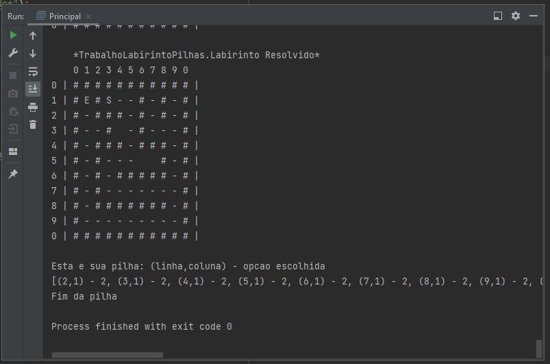
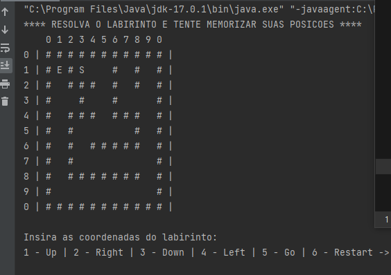
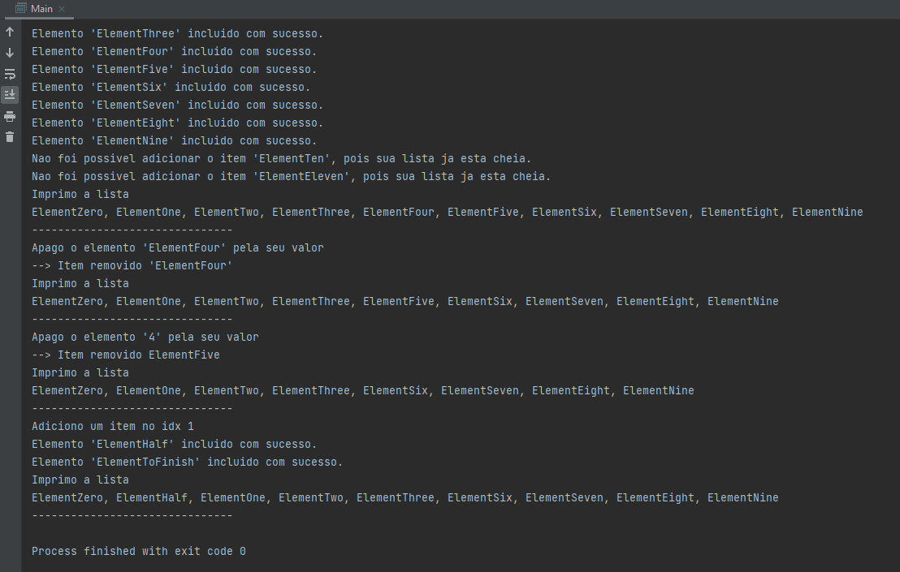

# TDE-Estrutura-de-Dados
TDE Estrutura de Dados

Este repositorio comtem os trabalhos de Estrutura de Dados

<ul>
  <li>Trabalho 01 - Pilhas</li>
  <li>Trabalho 02 - Fila</li>
  <li>Trabalho 03 - LinkedList</li>
</ul>

Ambos os trabalhos foram desenvolvidos na linguagem de programação Java.

<h2>Trabalho 01 - Pilhas</h2>

No trabalho, o computador irá realizar a execução de um labirinto automaticamente

 

 

<h2>Trabalho 02 - Fila</h2>

No trabalho, um usuário ira percorrer um labirinto até sua saída
 
 

<h2>Trabalho 03 - LinkedList</h2>

No trabalho, mostra-se a execução de uma linkedList com add, remove, etc.
 
 
